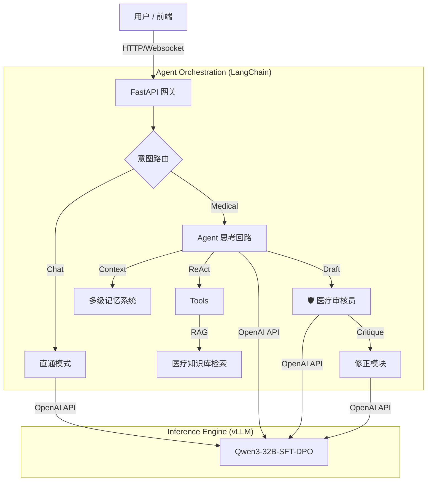

[English Version](README_en.md) | **中文版本**

# 基于 Qwen3-32B 的企业级医疗智能体全栈落地实践

> **项目代码**: Medical-Qwen
> **简介**: 从数据对齐 (DPO) 到高吞吐推理 (vLLM)，再到具备反思能力的 Agent 架构，打造工业级医疗问答闭环。

## 🚩 核心摘要

本项目基于 **Qwen3-32B** 基座模型，构建了一套端到端的 **企业级医疗 AI 解决方案**。不同于简单的 Prompt 工程，本项目打通了 **"数据清洗 → 监督微调 (SFT) → 偏好对齐 (DPO) → 高性能部署 (vLLM) → 智能体编排 (Agentic RAG)"** 的完整技术链路。

通过引入 **"医疗审核员" 反思机制** 与 **多级记忆系统**，解决了通用大模型在医疗场景下 "幻觉频发" 与 "安全合规" 的核心痛点。最终系统支持 **120 tokens/s** 的单实例推理速度，系统总吞吐量提升 82%，医学回答准确性提升 2.2 倍。

## ⚡ 核心亮点

### 1. 模型侧：SFT + DPO 深度对齐
*   **SFT (知识注入)**: 基于 Huatuo QA 清洗数据微调，将通用模型改造为医疗专用模型。医学准确性提升 **80%** (2.5→4.5)，医疗安全性提升 **220%**。
*   **DPO (安全围栏)**: 构建 5k+ 偏好对数据 (Self-Instruct)，针对性抑制 "万金油" 回复。相比纯 SFT 模型，医学参考答案对齐度 (ROUGE-L) 提升 **200%**。

### 2. 推理侧：vLLM 极致性能优化
*   **架构决策**: 采用 **BF16 + TP=2** 架构 (基于 4x RTX 6000 环境验证优化)。
*   **性能数据**: 单实例生成速度 **~120 tokens/s**。系统总吞吐量达到 **11.90 requests/s**，相比基准方案提升 **82%**。

### 3. 应用侧：Agentic RAG 与反思机制
*   **🛡️ 反思与自修正 (Reflection)**: 引入 "医疗审核员" 角色，采用 `Draft -> Critique -> Refine` 闭环，确保输出合规性。
*   **🧠 多级记忆架构 (Hierarchical Memory)**:
    *   **Entity Memory**: 异步提取患者画像（如过敏史），实现个性化诊疗。
    *   **Summary Memory**: 长对话自动摘要，大幅降低上下文占用。
*   **🔗 深度 RAG 优化**: 实现 Query Rewrite (口语转医学实体) 与 Evidence Grounding (强制引用检索证据)。

### 4. 工程侧：异步优先 (Async First)
*   **全链路异步**: 核心 `achat` 接口采用 `asyncio` 重构，适配 FastAPI 高并发场景，显著降低 TTFT (首字延迟)。

## 🛠️ 技术分层架构



## 📂 项目结构

项目目录结构如下：

- **`Medical-LLM/`**: 包含模型训练所需的资源（SFT & DPO）。
  - `dataset/`:
    - `data/`: 医疗数据集文件（如 jsonl 格式）。
    - `scripts/`: 数据预处理和格式转换脚本。
  - `configs/`: 训练配置文件（DeepSpeed 配置、训练参数文件等）。
  - `models/`: 用于存放训练后的模型权重。

- **`agent/`**: 包含 Agent 的逻辑、RAG 系统以及前后端部署文件。
  - `api/`: 后端 API 实现。
  - `core/`: Agent 的核心逻辑 (Memory, Reflection)。
  - `run_backend.py`: 启动后端服务的脚本。
  - `run_model.py`: 加载和运行模型的脚本。
  - `agent_ui.py`: Agent 的前端 UI 界面。

- **`LLaMA-Factory/`**: 用于高效微调的训练框架库。

## 🚀 安装与使用

### 环境要求

- Python 3.10+
- 支持 CUDA 的 GPU 设备

### 安装步骤

1.  克隆仓库：
    ```bash
    git clone https://github.com/your-username/Medical-Qwen.git
    cd Medical-Qwen
    ```

2.  安装依赖：
    ```bash
    pip install -r LLaMA-Factory/requirements.txt
    pip install -r agent/requirements.txt # (如果存在，否则请根据代码手动安装)
    ```

3.  **模型权重准备**：
    - 请下载 **Qwen3-32B** 原始模型权重，并放置在合适的目录（推荐 `../qwen3-32B`）。
    - 请下载 **BGE-M3** 嵌入模型权重，并放置在 `../bge-m3`。
    - **注意**：请务必更新 `agent/` 和 `Medical-LLM/scripts/` 下相关配置文件中的模型路径，确保指向您本地的真实路径。

### 训练 (SFT)

使用 **LLaMA-Factory** 配合提供的配置文件启动训练。

```bash
# 示例：使用配置文件运行 SFT
llamafactory-cli train Medical-LLM/configs/training_args_sft.yaml
```

### 运行 Agent

进入 `agent` 目录按照以下顺序启动服务：

1.  启动模型服务：
    ```bash
    cd agent
    python run_model.py
    ```

2.  启动后端服务：
    ```bash
    python run_backend.py
    ```

3.  启动前端 UI：
    ```bash
    python agent_ui.py
    ```

## 注意事项

- **大文件说明**：为了符合 GitHub 存储限制，部分超大的数据集文件（如部分 jsonl）和原始模型权重文件已被 `.gitignore` 排除，不包含在此仓库中。请确保您已单独下载必要的数据和预训练模型。
- **路径配置**：项目中涉及模型加载路径和数据路径的配置，请在使用前检查配置文件（如 config 文件或 Python 脚本中的路径变量）是否与您的本地环境一致。
