**English Version** | [中文版本](README.md)

# Medical-Qwen: Full-Stack Medical Agent System Based on Qwen3-32B

> **Industrial-Grade Medical AI Solution**
>
> A complete closed-loop practice from Data Alignment (SFT+DPO) to High-Precision Retrieval (RAG) and Reflective Agents (Agentic Workflow).

## 📖 Introduction

**Medical-Qwen** is an end-to-end AI solution designed for the vertical medical domain. This project aims to address the three core pain points of general large models in medical scenarios: **"Lack of Domain Knowledge"**, **"Frequent Hallucinations"**, and **"Poor Safety Compliance"**.

Going beyond simple Prompt Engineering, this project connects the full technology stack: **"Data Cleaning → Supervised Fine-Tuning (SFT) → Direct Preference Optimization (DPO) → Hybrid Retrieval-Augmented Generation (RAG) → Agent Orchestration → High-Performance Inference (vLLM)"**. The system achieves a single-instance inference speed of **120 tokens/s**, improves medical answer accuracy by **2.2x** compared to the base model, and features capabilities for long-term memory (e.g., patient allergies) and active risk control.

## 🏗️ System Architecture

```mermaid
graph TD
    User[User Terminal] <--> |WebSocket/HTTP| Gateway[FastAPI Async Gateway]
    
    subgraph "Agent Orchestration"
        Gateway --> Router{Intent Router}
        Router --> |Chit-chat/General| LLM_Direct[Direct Mode]
        Router --> |Medical Consult| Agent_Core[Agent Core Loop]
        
        Agent_Core <--> Memory[Hierarchical Memory]
        Agent_Core --> |Draft| Auditor[🛡️ Medical Auditor]
        Auditor --> |Critique| Refiner[Self-Correction Config]
    end
    
    subgraph "RAG Engine"
        Agent_Core --> |Query| Rewrite[Query Rewrite]
        Rewrite --> HybridSearch["Hybrid Search (BM25 + Vector)"]
        HybridSearch --> Rerank[BGE-Reranker]
        Rerank --> Context[Medical Evidence Chain]
    end

    subgraph "Model Layer"
        LLM_Direct & Agent_Core & Refiner --> |OpenAI Compatible API| vLLM_Engine[vLLM Inference Engine]
        vLLM_Engine -- Load --> Qwen_Weights["Qwen3-32B (SFT + DPO)"]
    end
```



## 🌟 Core Modules

### 1. 🧠 Model Alignment
*Injecting medical knowledge and standardizing behavior.*

- **SFT (Supervised Fine-Tuning)**: Based on cleaned and structured **Huatuo QA** datasets, employing LoRA efficient fine-tuning to transform general models into medical-specific models with clinical thinking.
- **DPO (Direct Preference Optimization)**: Constructed 5k+ pairs of `(chosen, rejected)` preference data to suppress "generic" safe responses and enforce strict adherence to medical guidelines.
    - **Results**: Compared to the pure SFT model, alignment with medical reference answers (ROUGE-L) improved by **200%**, and safety metrics improved by **220%**.

### 2. 📚 RAG (Retrieval-Augmented Generation)
*Solving hallucinations and ensuring evidence-based answers.*

- **Hybrid Search Strategy**: Combines **BM25** (Keyword Matching for terminology) and **Embedding** (Vector Matching for semantics) to resolve recall shortcomings of single retrieval paths.
- **Two-Stage Re-ranking**: Introduces the **BGE-Reranker** model to fine-score initial results, improving Top-N document relevance accuracy to over 90%.
- **Source Attribution**: Forces the model to cite `[Evidence ID]` when generating answers, realizing "every sentence has a source" to meet interpretability needs in medical scenarios.
- **Query Rewriting**: Uses LLM to transform user colloquial descriptions into standard medical entity queries, improving retrieval hit rates.

### 3. 🤖 Agentic Architecture
*Simulating doctor reasoning with logic and state management.*

- **Reflection & Self-Correction Loop**:
    - Introduces a **"Medical Auditor"** role.
    - Adopts a `Draft -> Critique -> Refine` workflow to automatically intercept contraindicated suggestions and potential risk content.
- **Hierarchical Memory System**:
    - **Entity Memory**: Real-time extraction and maintenance of patient profiles (e.g., allergies, chronic history, current medications) for cross-session personalized risk control.
    - **Summary Memory**: Periodic semantic compression of long dialogue windows to significantly reduce inference costs while retaining key context.
- **Tool Use**: Integrates external tools like BMI calculators, drug inventory queries, and department triage to extend model capabilities.

### 4. ⚡ Engineering & Inference
*Industrial-grade high concurrency and low latency implementation.*

- **vLLM Optimization**: Utilizes **PagedAttention** for memory management and enables **Continuous Batching**.
    - **Config**: BF16 Precision + Tensor Parallelism (TP=2).
    - **Performance**: Single-instance generation speed reaches **~120 tokens/s**, with total system throughput (TPS) increased by **82%** compared to HuggingFace native inference.
- **Async First**: The entire link (API Gateway, RAG Retrieval, Agent Reasoning) is refactored with `asyncio`, significantly reducing Time-to-First-Token (TTFT) and adapting to high-concurrency scenarios.

## 📂 Project Structure

```text
Medical-Qwen/
├── Medical-LLM/             # [Module 1] Model Training Layer
│   ├── dataset/             # Data preprocessing scripts & cleaned data
│   ├── configs/             # DeepSpeed & LoRA training configurations
│   └── scripts/             # Data processing scripts (Note: Use llamafactory-cli for training)
├── agent/                   # [Module 2&3] RAG & Agent Application Layer
│   ├── core/
│   │   ├── memory.py        # Hierarchical memory implementation
│   │   ├── reflection.py    # Medical auditor / Reflection mechanism
│   │   └── rag_engine.py    # Hybrid search & reranking logic
│   ├── api/                 # FastAPI backend interface
│   ├── agent_ui.py          # Interactive frontend (Gradio/Streamlit)
│   └── run_backend.py       # Service entry point
└── requirements.txt         # Project dependencies
```

## 🚀 Quick Start

### Prerequisites
*   Python 3.10+
*   NVIDIA GPU (VRAM >= 24GB Recommended)

### 1. Installation
```bash
git clone https://github.com/your-username/Medical-Qwen.git
cd Medical-Qwen
pip install -r requirements.txt
```

### 2. Model Preparation
Please place the downloaded model weights in the following suggested paths (ensure config files point to these paths):
*   **Base Model**: `../models/qwen3-32b-instruct`
*   **Embedding**: `../models/bge-m3`
*   **Reranker**: `../models/bge-reranker-large`

### 3. Launch Services

**Step 1: Start vLLM Inference Service**
```bash
python -m vllm.entrypoints.openai.api_server \
    --model /path/to/your/sft-model \
    --served-model-name qwen-medical \
    --tensor-parallel-size 2 \
    --port 8000
```

**Step 2: Start Agent Backend**
```bash
cd agent
python run_backend.py
# The backend will automatically connect to vLLM and the Vector Database
```

**Step 3: Start UI**
```bash
cd agent
python agent_ui.py
```
